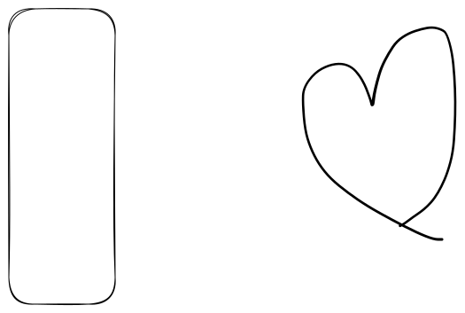

# inae

\| ㄹㄹㄹ | ㄹㄹㄹㄹ | ㄹㄹㄹ|

| head1 | head2 | head3 |
| ----- | ----- | ----- |
| asdf  | asd   | ffd   |
| asdf  | f     | ddf   |
| fdf   | f     | dfd   |



asdfasdf




asdfasdf




hint


<table data-view="cards"><thead><tr><th></th><th></th><th></th></tr></thead><tbody><tr><td>ddd</td><td></td><td></td></tr><tr><td>ddd</td><td></td><td></td></tr><tr><td></td><td>ddd</td><td></td></tr></tbody></table>

* [ ] ddd
* [ ] ddd
* [ ] ggg
* [ ] ss
*

